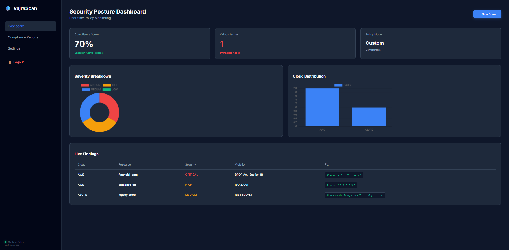
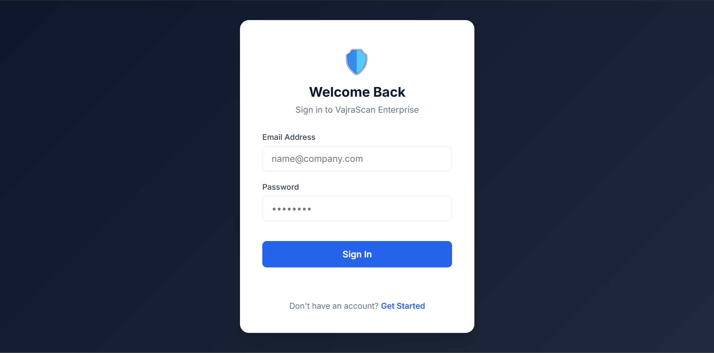
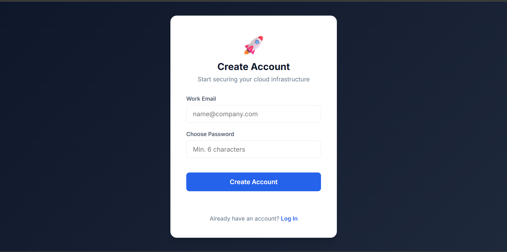

# 🛡️ VajraSafe | Enterprise Cloud Security Engine

> **"Secure your Infrastructure before you deploy."**
> *Automated compliance scanning for Terraform (IaC) with Indian DPDP Act & ISO 27001 enforcement.*


## 🚀 The Problem
Modern companies deploy cloud infrastructure using code (Terraform). A single mistake—like leaving a database open (`0.0.0.0/0`)—can lead to massive data breaches. Manual audits are too slow and prone to human error.

## 💡 The Solution
**VajraSafe** is a SaaS-ready platform that scans Terraform files for security violations instantly. It acts as a "spellchecker" for cloud security, ensuring your infrastructure is compliant with Indian and Global privacy laws before it ever goes live.

---

## 📸 Interface & Features

### 🛡️ Security Dashboard
*Real-time visualization of critical risks, severity breakdown, and cloud distribution (AWS/Azure).*


### 🔐 Secure Authentication (Firebase)
*Enterprise-grade Login and Signup system with Role-Based Access Control.*
<p float="left">
  
   
</p>

### ☁️ Automated Deployment
*Server auto-detects cloud keys and deploys securely on Render.*


---

## ✨ Key Features

### 🔐 Enterprise Security
* **User Isolation:** Multi-tenant architecture ensures User A cannot see User B's scan results.
* **Bank-Grade Privacy:** All scan data is encrypted and stored securely in **Firestore**.

### ☁️ Intelligent Scanning
* **Multi-Cloud Support:** Detects misconfigurations in **AWS** (S3, EC2, SG) and **Azure** (Storage, VM).
* **Compliance Logic:** Specifically flags violations of:
    * **Indian DPDP Act 2023** (e.g., Public PII storage).
    * **ISO 27001** (e.g., Unrestricted network access).

---

## 🛠️ Tech Stack

| Component | Technology |
| :--- | :--- |
| **Frontend** | HTML5, CSS3 (VajraGuard UI), Chart.js |
| **Backend** | Node.js, Express.js |
| **Logic Engine** | Python 3.10 (HCL Parsing) |
| **Authentication** | Firebase Auth (Email/Password) |
| **Database** | Firebase Cloud Firestore |
| **Deployment** | Render (Cloud PaaS) |

---

## ⚙️ Installation & Setup (Local)

### 1. Clone the Repository
```bash
git clone [https://github.com/SoumyadeepSaha2005/VajraSafe.git](https://github.com/SoumyadeepSaha2005/VajraSafe.git)
cd VajraSafe